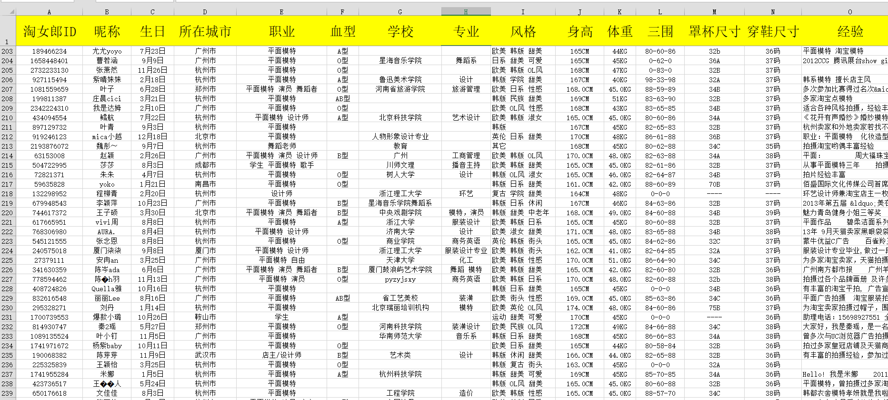

# mmtao
Ajax数据的爬取（淘女郎为例）

# 淘女郎模特抓取教程

> 网址：[https://0x9.me/xrh6z](https://0x9.me/xrh6z)

 
### 判断一个页面是不是 Ajax 加载的方法：
> 查看网页源代码，查找网页中加载的数据信息，如果源代码中不显示，证明是 Ajax 加载。
如果是网站源代码中就包含要爬取的信息，那么就直接只用正则拿数据出来就行了
但是如果网页源码中没有，那么就是 Ajax 了，可以进行抓包找到获取数据的相关接口，操作如下（以爬取淘女郎美女信息为例）：

## 一、初级

1. 寻找 API 接口：获取模特列表。

如果使用的是 Chrome 的话，可以首先选中 XHR 来更快速的找出获取数据的 API，如果在 XHR 里面没有再去 JS 里面一个个的寻找。

2. 找到 API 的 URL 为：[https://mm.taobao.com/alive/list.do](https://mm.taobao.com/alive/list.do)

经过尝试，后面的参数都是可以去掉的，访问的时候默认 page 为 1 ，所以如果要获取到所有页，需要使用 for 循环分别获取每一页的模特列表。

3. 然后打开一个模特的详情页面，使用红框圈住的地方都是我们要获取到的数据

4. 打开开发者工具，然后进行和刚刚相似的抓包操作。首先选中 XHR 进行快速的找出获取数的 API 接口，可以很容易的找到这个地址：

## 二、中级

下面我们抓取所有的妹子数据到文件中：

1.	不难找到获取后台数据的地址为：[https://mm.taobao.com/tstar/search/tstar_model.do?_input_charset=utf-8](https://mm.taobao.com/tstar/search/tstar_model.do?_input_charset=utf-8)

2.	但是我们发现在地址的 GET 参数中只有一个_input_charset=utf-8，而且默认获取的是第一页的妹子列表，正常情况下我们在 GET 参数中可以看到page=1类似的项，但这里没有，那么很显然它没有用GET就肯定用了 POST ，结果一看发现确实是这样子的。

3.	那么，这就简单了，使用 requests 库 post 请求数据，将请求来的 json 数据保存成表格，这项工作就结束了。

下面贴出代码：

a. [myheaders.py](myheaders.py)    ----这个文件里保存了一些常用的 headers 头信息

    #!/usr/bin/env python
    # -*- coding: utf-8 -*-
    # @Date: 2018-02-02 19:40:50
    # @Author  : cnsimo (2020745751@qq.com)
    # @Link: http://www.scriptboy.com
    # @Version : 1.0
    import random
    
    uaStr = '''Mozilla/5.0 (Macintosh; U; Intel Mac OS X 10_6_8; en-us) AppleWebKit/534.50 (KHTML, like Gecko) Version/5.1 Safari/534.50
    Mozilla/5.0 (Windows; U; Windows NT 6.1; en-us) AppleWebKit/534.50 (KHTML, like Gecko) Version/5.1 Safari/534.50
    Mozilla/4.0 (compatible; MSIE 8.0; Windows NT 6.0; Trident/4.0)
    Mozilla/4.0 (compatible; MSIE 7.0; Windows NT 6.0)
    Mozilla/5.0 (Windows NT 6.1; rv,2.0.1) Gecko/20100101 Firefox/4.0.1
    Mozilla/5.0 (Windows NT 6.1; rv,2.0.1) Gecko/20100101 Firefox/4.0.1
    Mozilla/5.0 (Macintosh; Intel Mac OS X 10_7_0) AppleWebKit/535.11 (KHTML, like Gecko) Chrome/17.0.963.56 Safari/535.11
    Opera/9.80 (Windows NT 6.1; U; en) Presto/2.8.131 Version/11.11
    Mozilla/4.0 (compatible; MSIE 7.0; Windows NT 5.1; Trident/4.0; SE 2.X MetaSr 1.0; SE 2.X MetaSr 1.0; .NET CLR 2.0.50727; SE 2.X MetaSr 1.0)
    MQQBrowser/26 Mozilla/5.0 (Linux; U; Android 2.3.7; zh-cn; MB200 Build/GRJ22; CyanogenMod-7) AppleWebKit/533.1 (KHTML, like Gecko) Version/4.0 Mobile Safari/533.1'''
    
    def getUA():
    	uaList = uaStr.split('\n')
    	length = len(uaList)
    	return uaList[random.randint(0,length-1)]
    
    if __name__ == '__main__':
    	print(getUA())

b. [mmtao.py](mmtao.py)       -----主程序

    #!/usr/bin/env python
    # -*- coding: utf-8 -*-
    # @Date: 2018-02-02 23:11:08
    # @Author  : cnsimo (2020745751@qq.com)
    # @Link: http://www.scriptboy.com
    # @Version : 1.0
    
    from myheaders import getUA
    import requests
    import re
    import time
    import csv
    
    mmListUrl = 'https://mm.taobao.com/tstar/search/tstar_model.do?_input_charset=utf-8'
    mmUrl = ''
    
    # 获得总共的页数
    def getTotalPage():
    	headers = {'User-Agent': getUA()}
    	req = requests.get(mmListUrl, headers=headers)
    	res = req.json()
    	return res['data']['totalPage']
    
    # 获取列表的函数
    def getMMList(cpage = 1):
    	headers = {'User-Agent': getUA()}
    	payload = {'currentPage': cpage, 'pageSize': 100, 'sortType': 'default', 'viewFlag': 'A'}
    	req = requests.post(mmListUrl, headers=headers, data=payload)
    	res = req.json()
    	if 'data' in res.keys():
    		return res['data']['searchDOList']
    	else:
    		return
    
    if __name__ == '__main__':
    	totalPage = getTotalPage()
    	with open(r'mmlist.csv', 'w+', newline='') as fs:
    		count = 1
    		cpage = 1
    		csvwriter = csv.writer(fs, dialect='excel')
    		page1 = getMMList(cpage)
    		csvwriter.writerow(page1[0].keys())
    		print('正在处理第%s页。。。' % cpage)
    		for mm in page1:
    			csvwriter.writerow(mm.values())
    			print(str(count)+' ', end='')
    			count += 1
    		print()
    		while cpage < totalPage:
    			cpage += 1
    			print('正在处理第%s页。。。' % cpage)
    			time.sleep(2)
    			mmList = getMMList(cpage)
    			if not mmList:
    				break
    			for mm in mmList:
    				csvwriter.writerow(mm.values())
    				print(str(count)+' ', end='')
    				count += 1
    			print('')
    
    	print('所有数据处理完毕!')

导出的数据如下：

## 三、高级

虽然说数据已经出来了，但是对模特的描述还是不够具体，想要更具体的数据得通过他们的模特卡获得，例如：[https://mm.taobao.com/self/model_info.htm?spm=719.7800510.a312r.22.bKq7m9&user_id=277949921](https://mm.taobao.com/self/model_info.htm?spm=719.7800510.a312r.22.bKq7m9&user_id=277949921)

这里的信息要更加全面一些，所以我们从列表也只获取模特 ID ，然后通过模特卡来拿到更加详细的信息。

1.	首先分析模特卡页面，还是通过开发者工具，我们很容易找到了获取数据的 URL ：[https://mm.taobao.com/self/info/model_info_show.htm?user_id=277949921](https://mm.taobao.com/self/info/model_info_show.htm?user_id=277949921)

2.	这次响应的数据并不是格式的，不过没有关系，我们还可以使用正则表达式将信息匹配出来。
3.	这样我们仅仅比刚才编写的程序多了一个分析模特卡的步骤，很快就能写出来这个代码了。

部分数据截图：

代码详见： [mmtao_plus.py](mmtao_plus.py)      如有问题，转到 [Wiki](https://github.com/cnsimo/mmtao/wiki/FQA)
